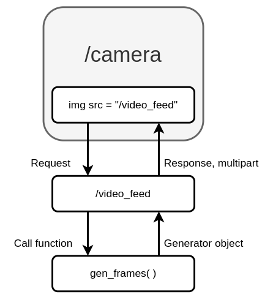
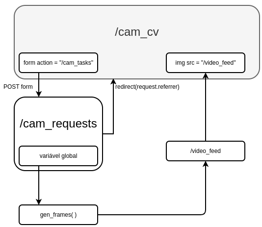

# **Blueprint da câmera**

## **Geração de frames**

### função gen_frames( )
Localização: app/camera/views.py

https://flask.palletsprojects.com/en/2.1.x/api/?highlight=yield#stream-helpers

- *Generator function*
- Utiliza yield para retornar frames da câmera como *generator objects* (iteráveis) e compor a stream de imagens
- Envia imagens como bytes para a stream da câmera

### view /video_feed
Localização: app/camera/views.py

https://flask.palletsprojects.com/en/2.1.x/api/#response-objects 

- View intermediária, responde com o stream de frames da *função gen_frames( )*
- Retorna um objeto do tipo *Response* que mimetiza a classe multipart (usada para streams em HTML)
- “Boundary”: separador de objetos da stream

### view /camera
Localização: app/camera/views.py

| Role      | Permissões |
| :----- | :-----|
| Usuário  | Visualizar a câmera |
| Moderador     |   Iniciar/parar gravação |
| Administrador      |    Habilita/desabilita visualização da câmera |

### template camera.html
app/templates/camera/camera.html

- Utiliza a view */video_feed* para a fonte da imagem
- Acessar */camera* dispara */video_feed*, que tem como resposta a stream criada pela generator function *gen_frames( )*

## Ciclo de geração de frames

  

## **Ciclo de requests de funções da câmera**

### view /cam_requests
Localização: app/camera/views.py

- View intermediária, utilizada para mudar variáveis globais: detecção de face, movimento, vista de câmera e gravação
- Recebe os forms (POST) vindos dos botões no HTML

  

