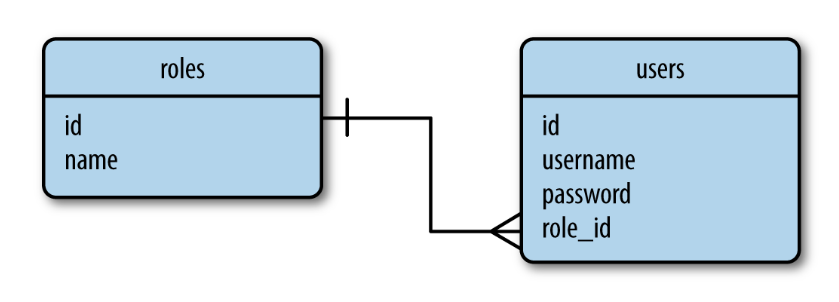

# **Banco de dados**

## **Classe  Permission**
- Trata permissões aritmeticamente (fácil expansão)
- Potências de 2 tornam operações binárias possíveis

## **Tabelas**
localização: app/models.py
Tratadas como classes

### **Roles**
- Linhas armazenam identificação de função (*role*)
- Permissões tratadas por aritmética pelos métodos *add_permissions()* e *remove_permissions()*
- Método *has_permissions( )* retorna *True* se a *role* possui a permissão desejada

### **User**
- Linhas armazenam informações do usuário
- Método *can( )* retorna o valor do método *Roles.has_permissions( )*

## **Relação entre tabelas**

Relação *one-to-many* entre roles (roles.id) e users (users.role_id).

  

Fonte: Adaptado de (GRINBERG, 2018) - Figure 5-1

# **Permissões por decorators**

Localização: app/decorators.py

https://www.geeksforgeeks.org/decorators-in-python/

*decorators* modificam o funcionamento de funções ou classes

- *@permission_required(Permission.MODERATE)*: adiciona a funcionalidade do método *user.can( )* da classe da tabela para a função da view, permitindo o acesso apenas se a permissão do argumento for atingida
